2024 AoC repo. For more detailed thoughts about the problems, see https://abnew123.substack.com/

<!-- AOC TILES BEGIN -->
<h1 align="center">
  2024 - 26 ⭐ - Java
</h1>
<a href="src/solutions/Day01.java">
  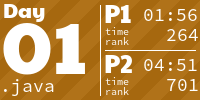
</a>
<a href="src/solutions/Day02.java">
  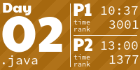
</a>
<a href="src/solutions/Day03.java">
  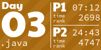
</a>
<a href="src/solutions/Day04.java">
  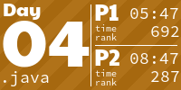
</a>
<a href="src/solutions/Day05.java">
  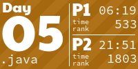
</a>
<a href="src/solutions/Day06.java">
  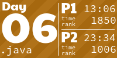
</a>
<a href="src/solutions/Day07.java">
  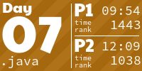
</a>
<a href="src/solutions/Day08.java">
  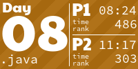
</a>
<a href="src/solutions/Day09.java">
  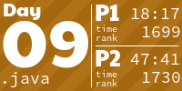
</a>
<a href="src/solutions/Day10.java">
  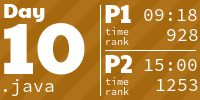
</a>
<a href="src/solutions/Day11.java">
  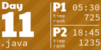
</a>
<a href="src/solutions/Day12.java">
  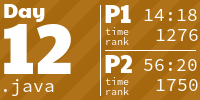
</a>
<a href="src/solutions/Day13.java">
  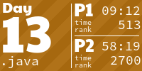
</a>
<!-- AOC TILES END -->
